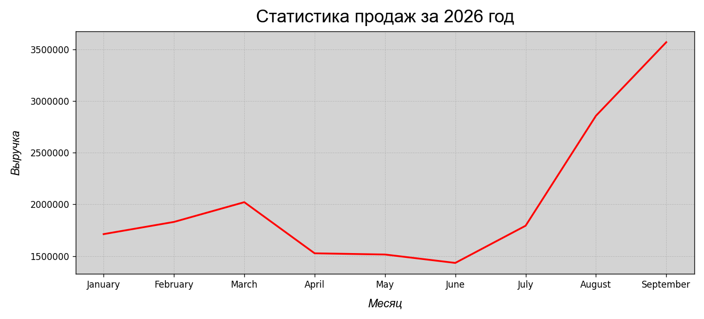
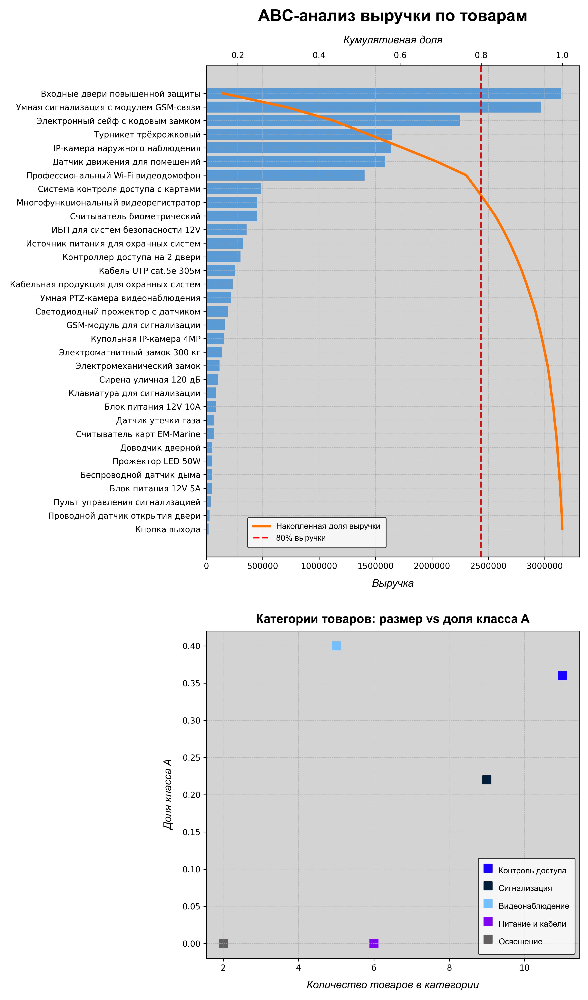
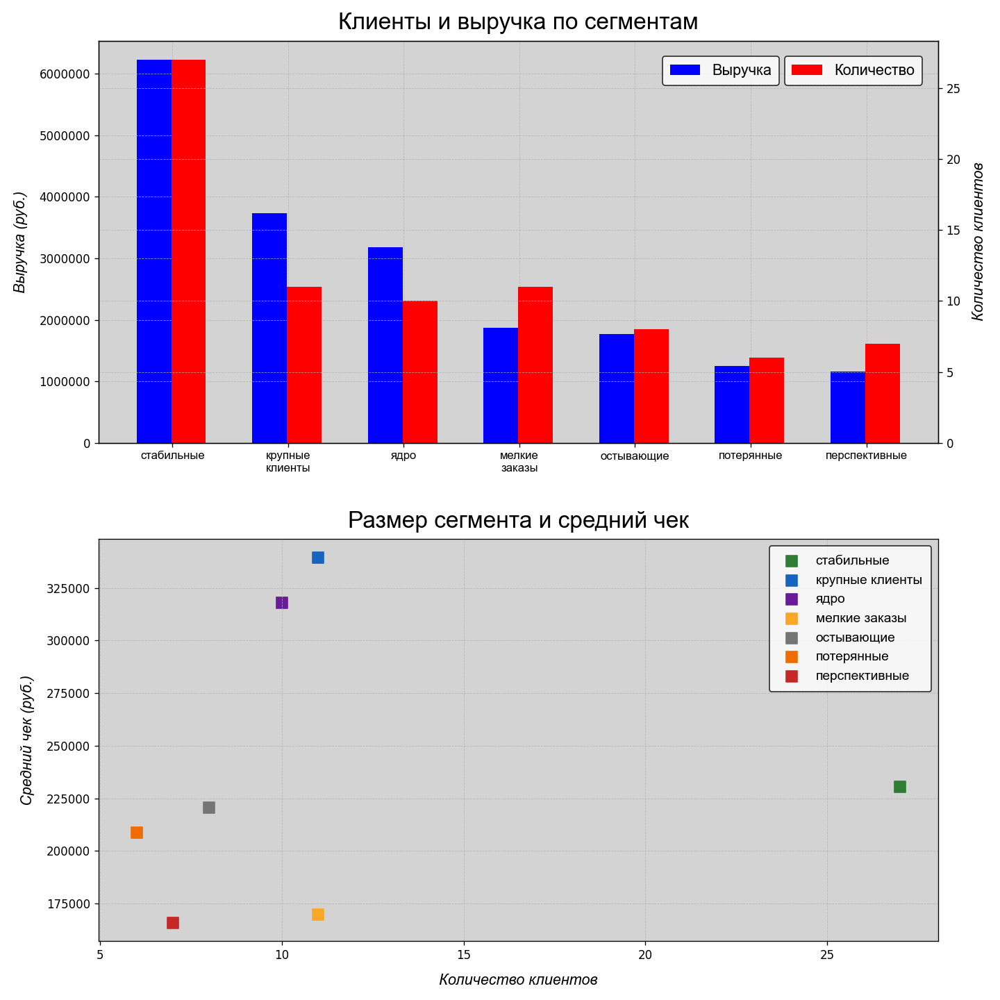
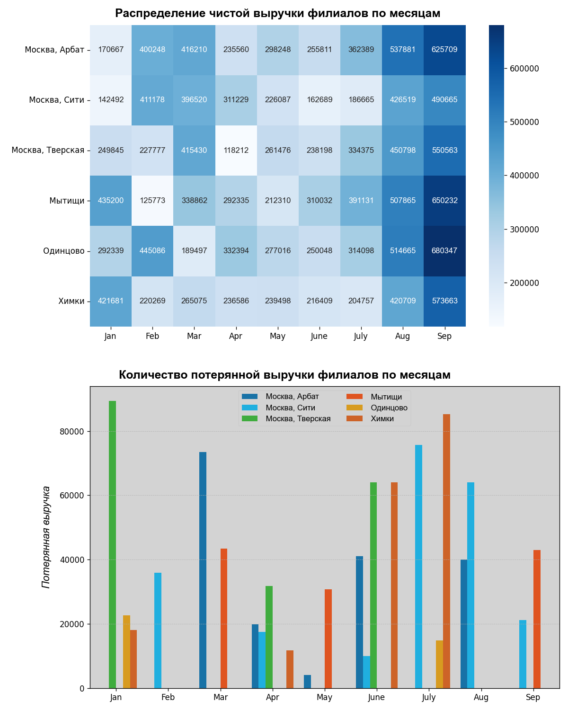
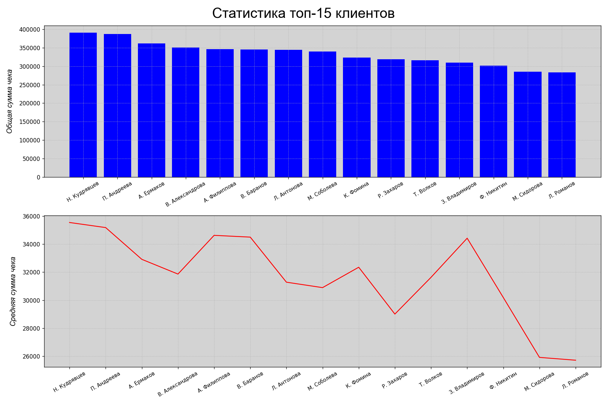
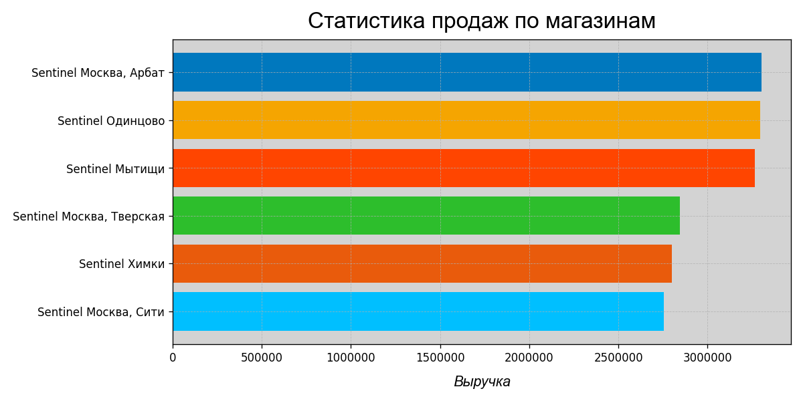

# Sentinel Analytics

Анализ продаж магазина охранных систем Sentinel за 2026 год.  
**HSE minor project, 2026**

## Стек
- Python 3.13
- SQL (SQLite)
- pandas, matplotlib, seaborn
- Jupyter Notebook

## Структура проекта
```text
sentinel/
├── .gitignore
├── analysis.ipynb
├── README.md
├── requirements.txt
├── sentinel.db
└── images/
    ├── abc_analysis.png
    ├── category_stats.png
    ├── client_stats.png
    ├── month_revenue_stats.png
    ├── rfm_analysis.png
    ├── selling_stats.png
    └── store_stats.png
```

## Содержание проекта 
1. Статистика продаж по месяцам — динамика выручки за 9 месяцев.
2. Статистика по категориям — распределение выручки по 5 категориям товаров.
3. Статистика по магазинам — сравнение 6 филиалов.
4. Топ-15 клиентов — общая сумма чека и средний чек.
5. Успешность продаж по месяцам — чистая и потерянная выручка по филиалам.
6. ABC-анализ товаров — 33 товара, деление на классы A/B/C.
7. RFM-анализ клиентов — 80 клиентов, деление на 7 сегментов.

## Запуск
```bash
pip install -r requirements.txt
jupyter notebook analysis.ipynb
```

## Результаты
### 1. Динамика продаж по месяцам

Провал с марта по июнь, резкий рост с июля, пик в сентябре (~3.6 млн ₽). Классический паттерн для рынка охранных систем: спрос растёт к концу года.

---

### 2. ABC-анализ товаров

- **Класс A** — 8 из 33 товаров дают 80% выручки.
- Топ-3 (входные двери, сигнализация с GSM, сейф) = 44% выручки → высокая зависимость от трёх позиций.
- **Класс B** — 10 товаров, 15% выручки. Резерв для роста.
- **Класс C** — 15 товаров, 5% выручки. Почти половина ассортимента не работает.

---

### 3. Сегменты клиентов (RFM)

- **Стабильные + ядро** дают ~49% выручки.
- **Крупные клиенты** — самый высокий средний чек (~340 тыс. ₽), их важно удерживать.
- **Перспективные и мелкие заказы** — много клиентов, но низкая выручка, нужна работа над повторными покупками.

---

### 4. Филиалы: чистая и потерянная выручка

- Пик у всех филиалов — сентябрь, провал — апрель.
- Отмены заказов дают 10–15% потерь.
- Лидеры по потерям — Тверская, Мытищи, Химки. При сопоставимой выручке одни филиалы теряют в 5 раз больше — вопрос к процессам, а не к спросу.

---

<details>
<summary><b>Дополнительные графики</b></summary>

**Статистика по категориям**

**Топ-15 клиентов**

**Статистика по магазинам**

</details>

## Контакты
Telegram: [@ob1101](https://t.me/ob1101)